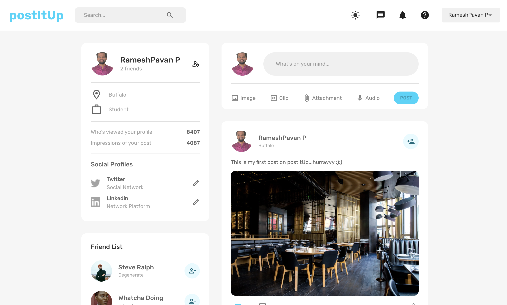
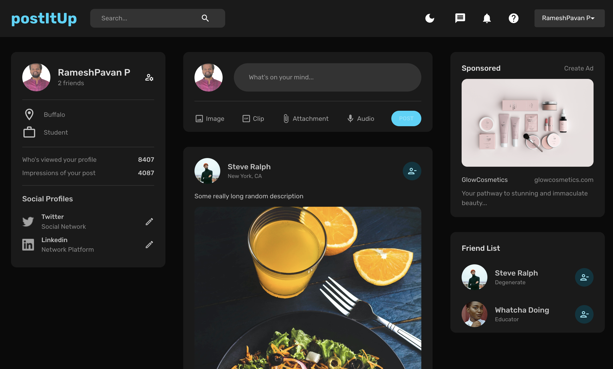

# postItUp - A social media platform to create posts.

postItUp is an social media platform developed using MERN stack where users can register,create posts,make friends and react to other user's posts. Available in light and dark modes.

## Technologies used:

1. ReactJS
2. NodeJS, Express
3. Redux, Redux-Toolkit
4. Mongo DB Atlas
5. Material UI

## Steps to run

1. Clone the repository.
2. cd client && && npm install && npm run start.
3. cd server && npm install && npm run start.
4. Create an account and use the application.
